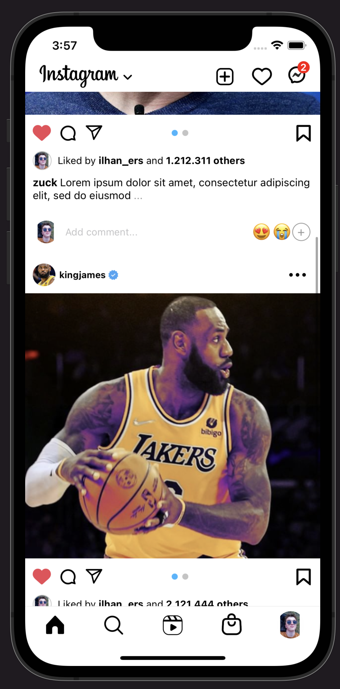
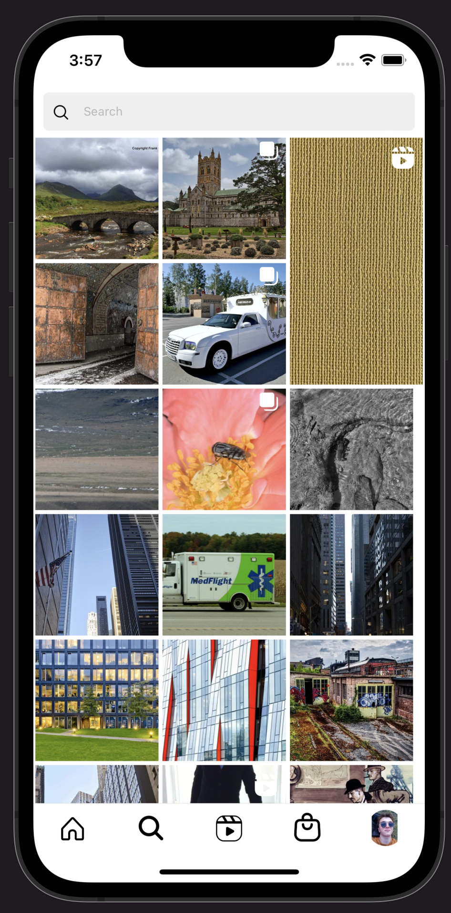
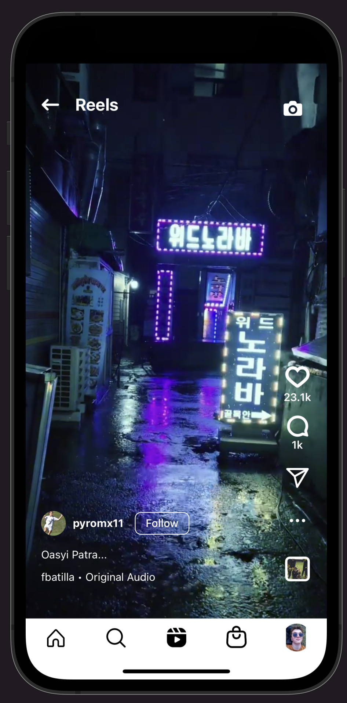
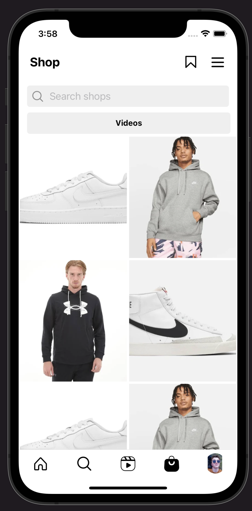
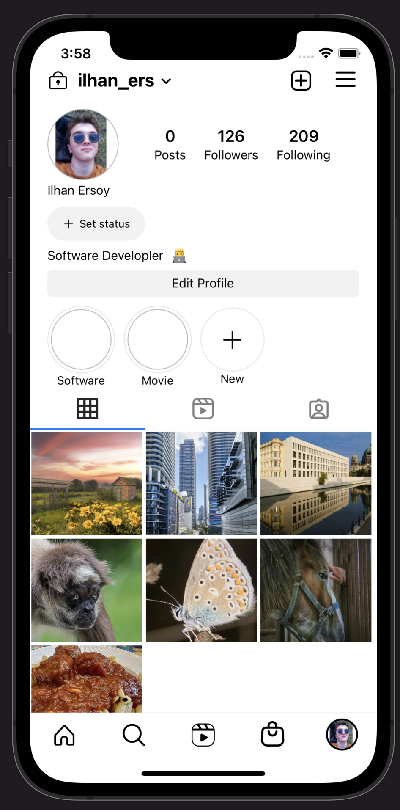

<!-- PROJECT LOGO -->
<br />
<p align="center">
  <a href="https://github.com/othneildrew/Best-README-Template">
    
  </a>

<h3 align="center">Instagram Clone App With React Native</h3>

  <p align="center">
    JS & React Native & Redux
    <br />
  </p>
</p>


<!-- ABOUT THE PROJECT -->
## About The Project
<table>
  <tr>
    <td></td>
    <td></td>
  <tr>
  <tr>
    <td></td>
    <td></td>
  <tr>
  <tr>
    <td></td>
    <td></td>
  <tr> 
 <tr>
    <td></td>
    <td></td>
  <tr>
  <tr>
    <td></td>
    <td></td>
  <tr>
  <tr>
    <td></td>
    <td></td>
  <tr>
<tr>
    <td></td>
    <td></td>
  <tr> 
</table>


### Built Wit

* [React Native](https://reactnative.dev/)
* [Redux](https://redux.js.org/introduction/getting-started)


<!-- GETTING STARTED -->
## Getting Started

### Prerequisites

------
* npm
  ```sh
  npm install npm@latest -g
  ```

### Installation


1. Clone the repo
   ```sh
   git clone https://github.com/ilhan-ersoy/forum-app-with-tdd
   ```
2. Composer
   ```sh
   composer install
   ```
3. .env Configration
   ```
   Rename or copy .env.example file to .env
   ```
4. Create Key
   ```
    php artisan key:generate
   ```
5. Set your own database credentials in your .env file

<!-- USAGE EXAMPLES -->
## Usage

This is a simple Forum app which peoples share a thread and reply to some threads.And in this app every endpoint or controller developed with tdd.

You can review my tests in [tests](https://github.com/ilhan-ersoy/laravel-forum-app-with-tdd/tree/master/tests)


_For more examples, please refer to the [PHPUNIT](https://phpunit.de/) -
[Laravel](https://laravel.com/)


<!-- CONTACT -->
## Contact

ilhan - [@Ilhaneer](https://twitter.com/Ilhaneer) - ilhan.ersoy.ie@gmail.com

Project Link: [https://github.com/ilhan-ersoy/laravel-forum-app-with-tdd](https://github.com/ilhan-ersoy/laravel-forum-app-with-tdd)


<!-- MARKDOWN LINKS & IMAGES -->
<!-- https://www.markdownguide.org/basic-syntax/#reference-style-links -->
[contributors-shield]: https://img.shields.io/github/contributors/othneildrew/Best-README-Template.svg?style=for-the-badge
[contributors-url]: https://github.com/othneildrew/Best-README-Template/graphs/contributors
[forks-shield]: https://img.shields.io/github/forks/othneildrew/Best-README-Template.svg?style=for-the-badge
[forks-url]: https://github.com/othneildrew/Best-README-Template/network/members
[stars-shield]: https://img.shields.io/github/stars/othneildrew/Best-README-Template.svg?style=for-the-badge
[stars-url]: https://github.com/othneildrew/Best-README-Template/stargazers
[issues-shield]: https://img.shields.io/github/issues/othneildrew/Best-README-Template.svg?style=for-the-badge
[issues-url]: https://github.com/othneildrew/Best-README-Template/issues
[license-shield]: https://img.shields.io/github/license/othneildrew/Best-README-Template.svg?style=for-the-badge
[license-url]: https://github.com/othneildrew/Best-README-Template/blob/master/LICENSE.txt
[linkedin-shield]: https://img.shields.io/badge/-LinkedIn-black.svg?style=for-the-badge&logo=linkedin&colorB=555

[product-screenshot-1]: images/1.png
[product-screenshot-2]: images/2.png
[product-screenshot-3]: images/3.png
[product-screenshot-4]: images/4.png
[product-screenshot-5]: images/5.png


